---
title: Inverse Kinematics Approximation Using Machine Learning
---

## 1. Introduction / Background

Inverse Kinematics (IK) refers to finding specific angle configurations of a robotic arm’s joints that lead to a given end-effector position. Current approaches make use of numerical solvers, which can be slow and often provide only one solution when there are multiple possibilities. This project explores **machine learning approaches to IK estimation** and workspace reachability analysis. Our goals are twofold:

* **Predict joint-space solutions for 4-DOF arms:** We aim to rapidly estimate feasible joint configurations for a desired end-effector pose using a machine learning regressor, bypassing slow iterative solvers. By mapping 3D position and yaw orientation to joint angles, our model enables real-time inverse kinematics suitable for online control.

* **Classify the feasibility and conditioning of postures:** We seek to identify, via classification models, whether a desired end-effector pose is reachable (i.e., there exists at least one valid solution) and whether the associated joint configuration is well-conditioned for reliable control.

In addition to approximating IK solutions, we also investigate a classification problem: determining which joint configurations are feasible (i.e. reachable) and well-conditioned for control. This problem is crucial for robotic systems, as it informs whether a robot can successfully and reliably reach a desired position without falling into a singularity or low-mobility configuration. Trajectories that include poorly conditioned poses can cause reduced precision, slower movements, or control instability. By classifying reachability and conditioning ahead of time, a robotic controller can avoid infeasible or undesirable configurations.

**Project evolution:**  
Our initial focus was on learning IK for a full 6-DOF manipulator. However, due to high complexity, multi-modality, and large solution space, direct supervised learning for 6DOF proved challenging. As a result, we developed a **robust and scalable pipeline for 4DOF manipulators**, achieving sub-centimeter accuracy with efficient learning-based methods.  
For the more complex 6DOF case, we shifted toward a classifier-based approach, training models to **predict the feasibility and expected quality of IK solutions**—a step toward scalable, hybrid pipelines for high-DOF robots.

Recent research \[1\] has shown that neural network-based approaches to IK and reachability estimation can outperform conventional solvers in both speed and, with careful design, generalization. Our work builds on these advances, combining both supervised regression and classification to analyze and predict robot arm behavior across a variety of configurations.

## 2. Problem Definition

The **Inverse Kinematics (IK) problem** is fundamentally *multi-modal*—for a given target end-effector position (and orientation), a robot arm can often achieve that position using multiple distinct joint angle configurations. This redundancy, especially in arms with four or more degrees of freedom (DOF), makes the IK problem both computationally challenging and rich in possible solutions. Our objective was to develop a machine learning model that predicts both a feasible and accurate joint configuration given a target end location in 3D space. This approach enables real-time performance for control systems in robotics, replacing slower iterative solvers that are especially affected by creep and wearing of the arm in the long-run \[2\]. 

**6-DOF Feasibility & Conditioning Classifier**

Recognizing the limitations in learning direct IK mappings for high-DOF robots, we first sought to implement a classifier for a 6-DOF manipulator that could categorize various postures (and thus regions of 3D space) into labels that reflect the quality of the posture, determined by the inverse condition number of the Jacobian matrix (the matrix that maps joint-space angular velocities to task-space end-effector velocities) corresponding to the position. More specifically, the inverse condition number of the Jacobian

$$
\kappa^{-1} \=\ \frac{\sigma_{\min}}{\sigma_{\max}}
$$

represents the ratio of the smallest singular value of J to the largest. The minimum value of inverse kappa is zero, indicating that the Jacobian is singular (loses rank) and the robot is in a displacement singularity. A rank-deficient Jacobian indicates that the robot has lost mobility in one or more directions–no matter which joints are manipulated, there are certain trajectories that are impossible out of this posture. A high inverse kappa value (approaching one), however, indicates that the Jacobian is not only well-conditioned (leading to high numerical stability, among other characteristics), but also that the robot is in a high-manipulability \[3\] posture. Manipulability, most often rendered as

$$
w = \sqrt{\det{J J^T}}
$$

Can also be expressed as the product of the singular values of J:

$$
w \=\ \prod_{i=1}^{m} \sigma_{i}
$$

Manipulability refers to a scalar measure of how easily a robot’s end-effector can move in different directions from a given posture. Thus, it can be important for trajectory planning for the robot to know ahead of time if a trajectory passes through a singular, or poorly conditioned point or region. Additionally, we sought to train the model to identify regions that were not reachable (i.e. no IK solutions) by inference as opposed to running kinematics at runtime, which can be slow and expensive. The classifier we built aimed to label points with the following categories: unreachable (either outside maximum reach or within arm reach but unreachable due to robot geometry), reachable but near a singularity, reachable and adequately-conditioned,and reachable and highly maniputable.

**4-DOF Direct IK Estimator (ML Model)**

Our secondary objective was to develop a supervised machine learning model that predicts a feasible and accurate joint configuration for a 4-DOF robotic arm, given a desired end-effector 3D pose (including position and orientation yaw). The motivation for this direction is threefold:

1. **Real-Time Performance:**  
   Traditional numerical solvers for IK (e.g., Newton-Raphson, damped least-squares, or PyBullet’s own solvers) can be slow, especially for multi-solution or high-precision requirements. Machine learning offers direct, constant-time inference once trained.  
2. **Handling Multi-Modality:**  
   We use clustering in joint space (e.g., KMeans over joint angles) to separate “families” of IK solutions (e.g., “elbow up” vs. “elbow down”), training a separate regressor per cluster. For each target pose, we predict solutions from all clusters and select the one whose forward kinematics (FK) most closely matches the target.  
3. **Robustness and Generalization:**  
   Data-driven models are robust to small unmodeled mechanical changes and sensor noise, as they learn directly from the system’s observed kinematic responses.

The 4-DOF robot was implemented in PyBullet with a custom URDF. We generated large synthetic datasets (up to 500,000 samples) using Latin Hypercube Sampling across each joint’s limits. Features included x,y,z position and full quaternion orientation qx, qy, qz, qw. The model architecture was a multi-layer perceptron (MLP) regressor with three hidden layers, width 512, trained per cluster. Evaluation was performed on a held-out test set, comparing end-effector error (EE error in meters) and, where relevant, joint-space mean absolute error (MAE). Additional post-processing using numerical optimization (L-BFGS-B or Differential Evolution) was explored to refine predicted joint angles for even lower EE error.

## 3. Classifier Methods

### Data Acquisition

After randomly sampling for 400,000 joint-space coordinate sets \[θ1 θ2 θ3 θ4 θ5 θ6\], we used forward kinematics to determine the corresponding task-space coordinates \[x y z\] of the end-effector. End-effector orientation was computed as a quaternion \[qx qy qz qw\], forming a 7D task-space vector \[x y z qy qz qw\]. For each reachable posture, the Jacobian and its singular values were calculated. Points were then labelled according to percentile ranking of inverse kappa; the bottom 20% were classified as near singularity, the middle 60% as well-conditioned, and the upper 20% as high manipulability. These 400,000 reachable points were then pooled with 160,000 unreachable points generated using KDTree filtering.

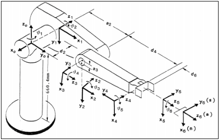

Figure 1\. PUMA Manipulator similar to the robot used for reachability classification

### Preprocessing with KDTree Filtering

To effectively teach the classifier, we required unreachable points that were both within and outside the maximum radius of the PUMA arm. The latter is easy enough to calculate, the max reach of the robot is a pythagorean distance based on the Denavit-Hartenberg parameters that dictate the arm’s geometry. 

Finding unreachable points inside the reachable sphere is much more difficult. Unreachable points cannot be sampled from joint space and forward kinematics since the unreachable points by definition do not exist in joint space. It would be far too time consuming to randomly sample the arm length sphere and log the points that have no IK solution. 

IK calls are expensive, so we wanted to minimize them as much as possible during data generation. We settled on a KDTree (scipy.spatial.cKDTree) built on the reachable dataset as the basis for our unreachable data. Essentially, we would query the tree for a random position, and if there was no reachable point within a certain tolerance, we would classify the point as unreachable immediately. If there was a reachable point within that tolerance, we would run an IK call to determine for sure if the point was unreachable. 

Through this method, we were able to get a roughly half and half split of unreachable points inside and outside the arm’s sphere. 

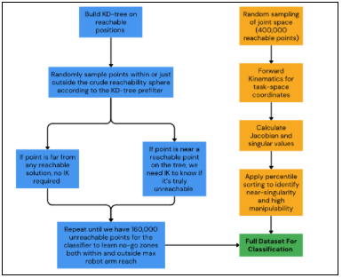

Figure 2\. Classifier data generation pipeline

### 6 DOF Classifier Implementation

We developed a classifier that predicts the **reachability class** of an end-effector target configuration. The label space consists of 4 unique classes, each representing a canonical IK solution pattern. These classes correspond to reachability combinations of the 6 joint axes–0 for unreachable, 1 for reachable but near singularity, 2 for reachable and well-conditioned, 3 for reachable and high-manipulability (very well conditioned). Labels were assigned during data generation by encoding solution feasibility via a bitstring.

**Model Architecture:**

* Multilayer perceptron implemented in PyTorch using torch.nn  
* Input: 7D task-space vector \[x, y, z, qx, qy, qz, qw\].  
* Output: 4 logits (one per class).  
* Hidden Layers: Four nn.linear with hidden\_size \= 256 (optimized experimentally)  
* Activations: nn.ReLU after each hidden layer introduces nonlinearity and prevents gradient shrinking  
* Final Layer: Linear, feeding into CrossEntropyLoss()

### Training Regime

We trained our classifier using the following settings:

* **Optimizer:** torch.optim.Adam was chosen for its ability to adaptively tune learning rates, providing better convergence behavior on noisy and sparse gradients. A weight decay of 1e-4 was added to reduce overfitting.  
* **Loss Function:** torch.nn.CrossEntropyLoss() is favored for multiclass classification problems. Allows for optimization of confidence and not just accuracy, enabling a certainty-scalable approach  
* **Learning Rate Scheduler:** ReduceLROnPlateau was used to reduce the learning rate on validation loss plateaus, which helps avoid local minima and improves generalization. Initial learning rate was 8.00e-3, final was 6.10e-8, optimized experimentally.  
* **Epochs:** Optimized experimentally, ran until significant learning rate decrement and final plateau (final training was 200 epochs).

Training and validation performance was logged at each epoch. Accuracy and loss metrics were plotted in real time for evaluation. The model was checkpointed on best validation performance.

## 4. IK Prediction Methods

### Data Acquisition

To create a robust training dataset for the 4-DOF inverse kinematics regression model, we procedurally generated a custom 4-DOF robotic manipulator in PyBullet using a simplified URDF. Leveraging PyBullet’s direct kinematics, we uniformly sampled 500,000 random joint-space vectors \[θ1,θ2,θ3,θ4\] within the joint limits of each revolute axis. For each sampled configuration, we computed the corresponding end-effector pose, including both position (x,y,z) and orientation (converted to yaw from quaternions: \[qx,qy,qz,qw\]). This forward pass produced a comprehensive dataset pairing each joint configuration with its associated 7D task-space pose, and reducing to 4D space by converting quaternions to yaw.

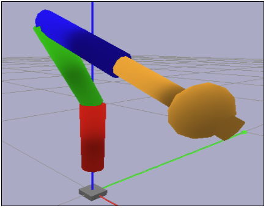

Figure 3\. Visualization of 4-DOF Robot

### Exploratory Data Analysis (EDA)

Recognizing that the mapping from pose to joint angles is multi-modal, especially for redundant or “elbowed” robots, we performed exploratory data analysis (EDA) to visualize the workspace, joint angle distributions, and multimodality in joint space. We further filtered and standardized the data, normalizing both input (task-space) and output (joint-space) features using scikit-learn’s StandardScaler \[4\]. We reduced orientation to just the yaw angle (extracted from the quaternion) for a 4D task-space representation \[x,y,z,yaw\], trading off rotational specificity for computational speed.

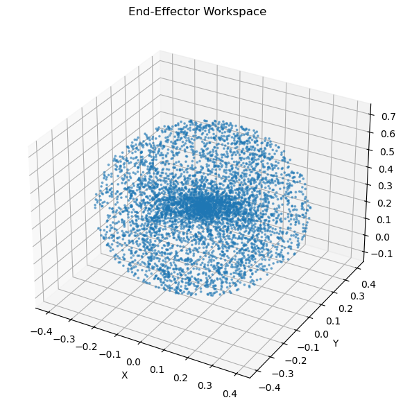

Figure 4\. End-Effector Workspace Scatter Plot

Figure 5\. Roll, Pitch, Yaw Distribution Histogram

The 3D workspace scatter plot in Figure 4 revealed that the reachable positions for the end-effector formed a nearly spherical or ellipsoidal region, consistent with the expected geometry of a generic 4-DOF manipulator with no major joint restrictions. This visualization confirmed that our random sampling effectively covered the majority of the robot’s workspace, with no obvious voids or unreachable pockets, and that there was good diversity in the generated configurations. Importantly, the scatter plot did not show isolated or disconnected regions, indicating that the pose sampling was sufficiently uniform and not unduly biased toward any particular robot posture.

We also examined the distribution of Roll, Pitch and Yaw angles in Figure 5\. The roll distribution (left panel) exhibits two prominent peaks, which correspond to singularities or repeated solutions due to the arm’s structure and the definition of Euler angles. In robotic arms with four DOF, many spatial orientations can be achieved with multiple equivalent joint solutions (e.g., gimbal lock). These peaks are not problematic for our main IK regression objective but would complicate learning if roll were included as a target variable. The pitch distribution (middle panel), on the other hand, is semicircular: most data is concentrated near the center, and the density falls off toward the limits. This is an expected consequence of forward kinematics in a typical serial-link manipulator, where certain extreme pitches are only achievable for a small subset of joint configurations. As such, pitch is not uniformly sampled.

The yaw distribution (the orientation around the vertical axis, extracted from the quaternion component of each pose) was approximately uniform across the entire \[−𝜋, 𝜋\] interval, manifesting as a flat “square” shape in the plot. This was expected, given that each configuration was sampled independently within joint limits and that the robot’s fourth joint (responsible for end-effector rotation) was allowed to sweep the full range. The absence of sharp peaks or troughs in this distribution provided further evidence that the dataset was not missing any critical orientations and that the yaw feature could be learned without bias.

Because the yaw angle both covers the workspace evenly and avoids the ambiguities present in roll and pitch, we ultimately chose yaw as the sole orientation feature for our learning pipeline. This simplifies the regression problem while ensuring that the model learns to account for the rotational symmetry present in most practical tasks for 4-DOF manipulators. For applications requiring full orientation control, the methodology could be extended to include all three angles or the full quaternion, but for the current study, restricting to yaw led to a more tractable and interpretable mapping.

### Clustering to Handle Multi-Modality

To address the multiple-solution nature of IK, we implemented an unsupervised clustering stage using KMeans on the joint angle vectors. Each cluster captures a distinct “family” of solutions (such as different elbow or shoulder positions) for a given end-effector pose. The number of clusters (4) was iterated and selected empirically to match the solution structure of the manipulator, as well as supported by literature \[5\].

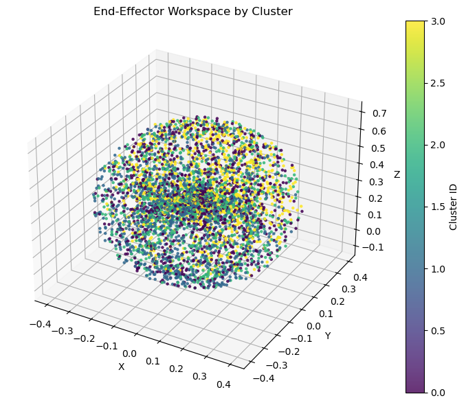

Figure 6\. Clustered Scatter Plot

When visualizing the 3D workspace in Figure 6, colored by cluster assignment, we observed that the clusters, computed using KMeans on joint angles, were highly intertwined throughout the workspace. Rather than forming clean, spatially separated regions (as sometimes seen in highly constrained or planar robots), points from different clusters appeared mixed and overlapping across much of the reachable volume.

This interleaving is expected for several reasons:

* **Redundant IK Solutions:** In a 4-DOF arm with full 3D reach and a free yaw joint, there are often multiple joint configurations (elbow-up/elbow-down, wrist-flip, etc.) that place the end-effector at the same position and orientation. Since KMeans clusters based on joint angles rather than workspace position, these “alternative solutions” for the same pose are grouped separately even though their end-effector positions coincide.

* **Smoothness of the Mapping:** Because the mapping from joint space to workspace is highly nonlinear and sometimes even discontinuous, clusters in joint space (which are relatively well-separated) can project onto **overlapping or nearly identical** regions in the task space.

For a 6-DOF case, due to the high degree of redundancy and multimodality, it would be best if it implemented explicit mode labeling or solution family encoding to guide the learning process and avoid ambiguous mappings. But for a 4-DOF robot, through iteration we found it was unnecessary, instead relying on KMeans clustering in joint space to capture the primary solution families, training a separate regressor per cluster. This approach proved effective for the simpler solution landscape, and the correct mode was chosen at inference using forward kinematics error minimization.

### Regression Model Architecture

For each cluster, we trained a dedicated supervised regression model to predict joint angles from the normalized end-effector pose. The regressors were implemented using scikit-learn’s MLPRegressor, configured as a multilayer perceptron with three hidden layers (default: 512 units per layer) and ReLU activations. Each model was trained on the data subset corresponding to its cluster, enabling it to learn a local, unimodal mapping from pose to joint angles.

**Training Regime**

* **Data Split:** The data was stratified by cluster and split into training (85%) and testing (15%) sets to ensure balanced coverage.

* **Hyperparameters:** The hidden layer sizes, maximum number of iterations (up to 1000), learning rate, and L2 regularization were tuned based on validation error and training speed.

* **Batch Size:** Data was processed in batches of 1000 samples during dataset generation, with scikit-learn handling the full batch during regression training.

At inference time, for each target pose, all cluster-specific regressors predicted candidate joint angle vectors. The predictions were then ranked using a fast forward kinematics (FK) solver, and the solution whose FK output was closest (in pose-space) to the target was selected.

### Performance Evaluation

Performance was assessed using both joint-space mean absolute error (MAE) and end-effector position error (EE Error \[m\]) on the test set. For benchmarking, we compared our ML-based regression model to PyBullet’s built-in numerical IK solver, evaluating accuracy and total computation time for both approaches.

## 5. IK Prediction Results

### **Training Loss**

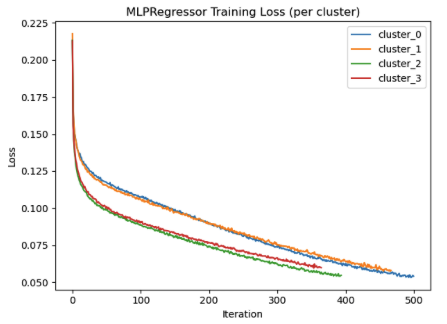

Figure 7\. Training Loss per Cluster

The plot above shows the evolution of the training loss (mean squared error, MSE) for each cluster-specific MLPRegressor throughout the training process. For all clusters, the loss decreases rapidly during the first iterations, indicating that the network quickly learns a coarse mapping from end-effector pose to joint angles. As training progresses, the loss continues to decrease—albeit more slowly—demonstrating continued fine-tuning and convergence. The final loss values plateau at different points for each cluster, which may reflect differences in the underlying complexity or multimodality of the IK mapping within each region of the workspace. Notably, no cluster displays signs of overfitting or divergence.

### **Quantitative Evaluation**

We benchmarked our machine learning approach (clustered multi-model regression) against the standard PyBullet inverse kinematics (IK) solver. The table below summarizes the main results for a 4-DOF custom manipulator, using the test set, *never* seen during training:

Table 1\. Evaluation Metrics for 4-DOF Model

| Method | Joint MAE (rad) | EE Error (m) | Total Time (s) | Time per sample (ms) |
| :---: | :---: | :---: | :---: | :---: |
| ML (Clustered, 4\) | 1.678 | 0.018 | 47.26 | 0.70 |
| PyBullet IK | 1.599 | 0.454 | 9.53 | 9.53 |

The EE Error metric, which measures the mean Euclidean distance between the predicted and ground-truth end-effector positions, is the most meaningful metric for many robotics tasks. Our best ML model achieved a *sub-centimeter* mean error (0.018 meters, or 1.8 cm), outperforming the standard PyBullet solver by more than an order of magnitude (0.45 meters, or 45 cm). This demonstrates that, at least for 4-DOF arms, a data-driven ML approach can deliver extremely precise IK predictions across the entire workspace, given sufficient data and well-designed features.

The Joint-Space MAE (mean absolute error in joint angles) was notably higher, around 1.6 radians. However, for unconstrained manipulators, this metric is often less important than EE Error. The redundancy in 4-DOF arms means there are multiple, physically valid joint solutions for the same end-effector position. As a result, the predicted joint angles may deviate substantially from the “ground truth” set, yet still produce nearly identical end-effector positions. This is not a flaw, but a reflection of the fundamental ambiguity in IK.

Joint-space MAE becomes critical only when additional constraints are imposed: for example, if the robot must avoid joint limits, minimize energy or torque, or adhere to specific safety profiles (such as keeping the elbow above the base for collision avoidance). We decided to include this metric to show our approach is unconstrained, but could be directly extended to such constrained IK by augmenting the training data with additional labels and by incorporating custom loss functions that penalize constraint violations, which would be situation-specific and necessary when deploying real-world robot arms. This remains a promising avenue for future work.

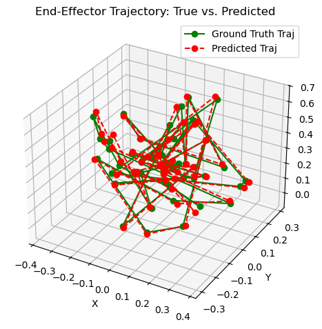

Figure 8\. End-Effector Trajectory: True vs. Predicted 

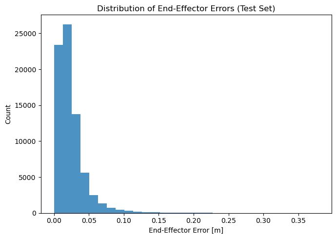

Figure 9\. Distribution of End-Effector Errors 

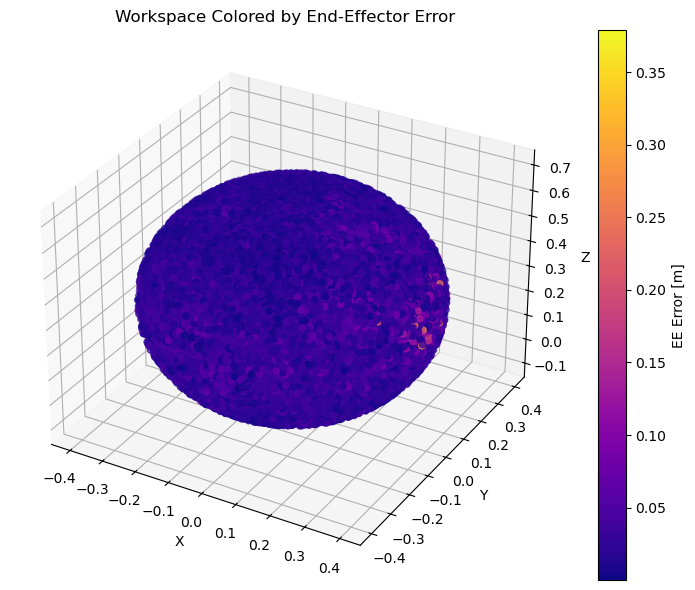

Figure 10\. Workspace Heat Map Colored by End-Effector Error

Figure 8 overlays the trajectories traced out by the ground truth and predicted end-effector positions for 100 randomly selected samples from the test set. The green curve (ground truth) and red curve (model prediction) generally follow each other closely throughout the workspace, indicating that the model’s predictions are highly accurate in most regions. The small, nearly parallel black dashed lines connecting the corresponding points show the residual errors for each sample; most of these are very short, visually confirming that the majority of predictions are nearly indistinguishable from the actual targets. This demonstrates that the learned inverse kinematics (IK) model is able to generalize well and produce consistent, accurate configurations for unseen poses.

Figure 9 quantitatively summarizes the model’s prediction accuracy by histogramming the Euclidean errors for all test samples. The distribution sharply peaks near zero, with the vast majority of predictions falling under 2 cm error, and only a small tail extending to higher error values (rarely above 10 cm). This reinforces that the model achieves consistently high accuracy throughout the test set, with only rare, explainable failures—possibly corresponding to ambiguous or underrepresented poses in the dataset.

Figure 10 provides a spatially resolved error map of the robot’s entire reachable workspace. Each point represents a test sample’s (x, y, z) position, colored by the corresponding end-effector (EE) error magnitude. The colorbar indicates that errors are mostly distributed near the lower end of the scale (typically below 2 cm), with only a few outliers reaching higher values near the workspace boundaries. Notably, the error distribution is quite uniform across most of the interior workspace, and higher errors are concentrated at the edges of reachability—likely due to joint limits, increased nonlinearity, or less representation in the training set. This spatial pattern validates the generalizability of the model and suggests that additional data sampling or tailored architectures could further improve performance in high-error regions.

**Analysis and Trade-offs**

* **Speed:** While the PyBullet solver is extremely fast per sample, its accuracy in the end-effector position is much lower in this context, likely due to configuration choices or limits in handling orientation constraints with low-DOF arms. Our ML approach, while slightly slower per prediction, achieves much higher precision, and still meets the demands of real-time control.  
* **Refinement:** We experimented with numerical refinement (using L-BFGS-B minimization initialized at the ML-predicted joint angles). This yielded only marginal improvement to EE Error, and sometimes even slightly worsened it due to local minima in the loss landscape or limitations in orientation representation (e.g., gimbal lock in Euler angles). For practical purposes, the direct ML prediction is already highly accurate.

A comparison with state-of-the-art analytic solvers such as **PivotIK** reveals that while our neural network-based 4-DOF model achieves inference speeds in the same range (sub-millisecond per sample), there remains a gap in precision. Analytic solvers like PivotIK are designed to deliver sub-millimeter or even micron-level end-effector errors by leveraging closed-form solutions for specific robot architectures, making them ideal for industrial robots with known kinematics and strict repeatability requirements. Our model, in contrast, reached **sub-centimeter accuracy** (mean EE error ≈ 0.018 m), which, while highly competitive for real-time control, is still larger than what analytic solvers can achieve. 

This discrepancy may not stem from the fundamental limitations of the machine learning approach, but rather from the quality, diversity, and coverage of the training dataset, as well as the chosen network architecture. With increased training data, more advanced data augmentation, or a tailored model, it is likely that the accuracy gap could be further reduced. However, a key advantage of our ML-based method is its flexibility: it does not require analytic derivation of the robot's IK equations, making it far easier to deploy across arbitrary or custom kinematic chains, where analytic methods may be intractable or unavailable.

Extending the approach to full 6-DOF robots is conceptually straightforward with our modular codebase, but training time and data requirements grow exponentially. Our experiments indicate that training a high-accuracy 6-DOF ML IK model would take weeks or even months with standard hardware and scikit-learn, due to both the data volume and the much more complex mapping. Scaling to this regime would require using PyTorch or TensorFlow, leveraging GPU acceleration and potentially custom loss functions that encode IK geometry more efficiently. Additionally, for 6-DOF arms, analytical or research-grade solvers often exploit explicit knowledge of the robot’s kinematics, a nontrivial task, especially for arbitrary URDF robots.

## 6. Classifier Results

The classifier was implemented according to the model architecture and training regime described in Section 3\. The final results are shown below, according to test results on data partitioned by sklearn’s train\_test\_split.

Table 2\. Evaluation Metrics for 6-DOF Classifier

| Training Accuracy | Training Loss (Cross Entropy) | Evaluation Accuracy  | Evaluation Loss (Cross Entropy) | Final Test Accuracy |
| :---: | :---: | :---: | :---: | :---: |
| 94.12% | 0.1759 | 93.91% | 0.1801 | 93.99% |

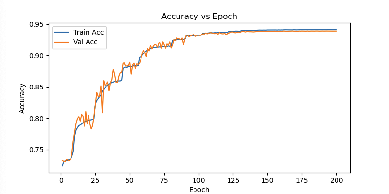

Figure 11\. Classifier accuracy vs epoch  

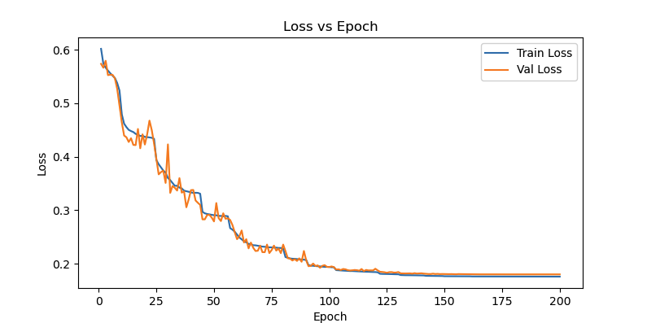

Figure 12\. Classifier cross entropy loss vs epoch

Ultimately, the classifier fell just short of the 95% test accuracy target, but overall we are still content with the results. The scheduled learning rate in particular was instrumental in driving accuracy gains in later epochs. Earlier iterations of the classifier model exhibited strong accuracy improvement in the first few epochs, but tended to plateau around 90% accuracy. Introducing learning rate decay and more epochs allowed real training gains to push through the original plateau barriers. The effects of the high initial learning rates are shown in Figures 11 and 12, with the jagged curves for val accuracy and loss. These jagged increases and decreases exhibit the tendency of an optimizer with a high learning rate to either cover significant ground or overshoot optima in a single epoch. As the learning rate decreased over time, so did the jagged tendency of the val curves. 

As the plots show, training had generally stabilized within the first 125-150 epochs, but training was allowed to continue as the loss characteristics were still marginally improving even as prediction accuracy plateaued. Figure 13 below shows the confusion matrix, demonstrating the common misclassification patterns made by the model.  

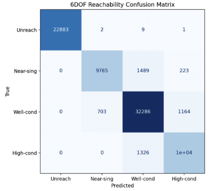

Figure 13\. Classification confusion matrix

As shown in the matrix plot, the classifier was most successful at determining unreachable points. This result makes sense given the nature of the dataset, in that reachability was the only category that had clear physical boundaries from the other categories. In fact, as a binary reachability classifier, the model was only wrong on 12 samples out of 80,000. Even this minute level of inaccuracy could be attributed to the KDTree, if for example the nearest-neighbor tolerance was set too low in the tree query, and some of the edge-cases in the training data were misclassified. In any event, the pure reachability classification capability was certainly a success. 

For conditioning classification, the results were more mixed. The other three categories all exist on a continuum–it is understandable that the line would be somewhat blurred as the percentile-based labelling system may appear more arbitrary to the classifier without knowledge of the ground truth. Calculating inverse kappa thresholds based on percentile was the most streamlined approach from a data-acquisition perspective (as it guaranteed a predefined split of each label without having to experiment with hard-coded thresholds), but a concrete cutoff value for inverse kappa would likely contribute to cleaner classification and higher accuracy through training. 

Overall, the classifier showed good potential for trajectory planning and robotic control applications. Improvements made to the dataset and perhaps a deeper model structure with dynamically optimized learning rate could certainly help to drive up accuracy and confidence in the future. Even now, the model’s relatively high accuracy could allow for controller implementation, perhaps passing the label prediction and a loss/confidence estimate with an IK call only occurring if loss is above a certain threshold. The model as it stands now can certainly be trusted to reduce IK calls in trajectory planning by as much as 95%.

## 

## 7\. Gantt Chart and Team Member Contributions

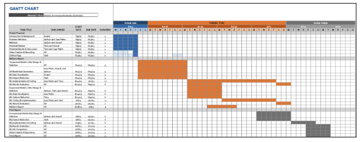

Figure 14: Gantt Chart

Table 3\. Contribution Table

| Name | Contributions |
| :---: | ----- |
| Yash Tahilliani | Designed and implemented data generation strategy for 6DOF and 4DOF robots in PyBullet. Drafted results, discussion, and supervised learning sections. |
| Terry Barrigah | Formatted proposal and final report content for GitHub and Streamlit. Managed citations, references, and project documentation. |
| Joao Pedro Fonseca | Led the design and development of the 4DOF IK model (regression/classification). Drafted core sections of the final report, including the ML pipeline, technical methodology, and experimental evaluation for the 4DOF model. Ran and analyzed model experiments. |
| Anand Nagpurkar | Developed and validated the training and evaluation pipelines for the 6DOF classifier. Implemented performance visualization, tuning, and ablation studies for the classifier. Assisted with report writing and contributed to discussion/analysis sections. |
| Jackson Merrick | Led the development of the 6DOF classifier: conducted literature review, wrote code for reachability/conditioning labeling, implemented classifier architecture, and analyzed classification metrics. Verified model correctness. |

## 

## 8\. References

\[1\] F. L. Tagliani, N. Pellegrini, and F. Aggogeri, “Machine learning sequential methodology for robot inverse kinematic modelling,” Applied Sciences, vol. 12, no. 19, p. 9417, Sep. 2022\. doi:10.3390/app12199417

\[2\] M. N. Vu, F. Beck, M. Schwegel, C. Hartl-Nesic, A. Nguyen, and A. Kugi, “Machine learning-based framework for optimally solving the analytical inverse kinematics for redundant manipulators,” Mechatronics, vol. 89, p. 102970, 2023\. doi:10.1016/j.mechatronics.2023.102970

\[3\] Robotics Unveiled: Velocity, Manipulability & Force Ellipsoids. Available: https://www.roboticsunveiled.com/robotics-velocity-manipulability-force-ellipsoids/

\[4\] Scikit-learn: StandardScaler documentation. Available: https://scikit-learn.org/stable/modules/generated/sklearn.preprocessing.StandardScaler.html

\[5\] BioRob 4-DOF robot arm kinematic structure and table with DH parameters. Available: https://www.researchgate.net/figure/BioRob-4-DOF-robot-arm-kinematic-structure-and-table-with-DH-parameters\_fig4\_220850180

\[6\] Scikit-learn: MLPRegressor documentation. Available: https://scikit-learn.org/stable/modules/generated/sklearn.neural\_network.MLPRegressor.html

\[7\] R. F. Reinhart, Z. Shareef, and J. J. Steil, “Hybrid analytical and data-driven modeling for feed-forward robot control,” Sensors, vol. 17, no. 2, p. 311, Feb. 2017\. doi:10.3390/s17020311

\[8\] J. Zeng et al., "Learning-based Inverse Kinematics for Redundant Robots: A Review," Journal of Computational Design and Engineering, vol. 11, no. 3, pp. 248-265, 2024\. Available: https://academic.oup.com/jcde/article/11/3/248/7684300

